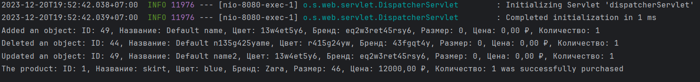

# Практическая работа №7. Архитектура REST

Седьмая практическая работа по дисциплине — Разработка корпоративных информационных систем

## Цель работы

Ознакомиться с механизмами поддержки архитектуры REST в Spring

## Задачи

Изменить практическую работу №5, добавив следующий функционал:

- Преобразовать веб-приложение таким образом, чтобы оно поддерживало архитектуру REST. Должны поддерживаться следующие
  типы запросов: GET (показ html и извлечение json всех/одной записей/сущностей), POST (добавление), PUT (
  редактирование), DELETE (удаление);
- Разработать REST-клиент для приложения, который с использованием RestTemplate позволяет выполнять базовые операции по
  извлечению (GET), добавлению (POST), редактированию (PUT), удалению (DELETE) ресурсов. REST-клиент не обязан иметь
  графический пользовательский интерфейс, необходим репрезентативный тестовый пример, который можно запускать из окна
  терминала;
- Обязательным условием является сохранение всего предшествующего функционала приложения. Для удовлетворения всем
  характеристикам REST- архитектуры приложение может быть реорганизовано (убраны GET-запросы с параметрами) или добавлен
  новый функционал;
- PUT- и DELETE- запросы не обязательно делать из браузера. Достаточно реализации для клиентов-приложений.


### Вариант №10

Одежда

## Инструкция по установке и настройке PostgreSQL

### 1. Установите PostgreSQL:

Убедитесь, что на Вашем компьютере установлен [PostgreSQL](https://www.postgresql.org/download/)
Для установки PostgreSQL на Linux Ubuntu / Debian, можно воспользоваться менеджером пакетов:

```
sudo apt-get update
sudo apt-get install postgresql postgresql-contrib
```

### 2. Инициализация базы данных:

Перейдите в директорию server и запустите скрипт ```init.sql``` с помощью следующей команды:

```
psql -U postgres -h localhost -f init.sql
```

В этом скрипте cоздается и наполняется данными таблица clothes

## Инструкция по сборке и запуску Java-проекта из командной строки

### 1. Установите JDK и Maven:

Убедитесь, что на Вашем компьютере
установлены [JDK](https://www.oracle.com/java/technologies/downloads/)
и [Maven — фреймворк для автоматизации сборки проектов](https://maven.apache.org/). Вы можете проверить это,
выполнив в командной строке следующую команду:

```
java -version
mvn -version
```

### 2. Компиляция и запуск:

#### 2.1 Запуск сервера
Откройте терминал и перейдите в директорию вашего проекта, в папку server, затем выполните следующие команды:

```
mvnw clean package
java -jar target/server-0.0.1-SNAPSHOT.jar
```
После запуска вы сможете осуществлять запросы к серверу, используя REST API. Примеры запросов показаны на рисунках ниже



#### 2.1 Запуск клиента
Откройте терминал и перейдите в директорию вашего проекта, в папку client, затем выполните следующие команды:

```
mvnw clean package
java -jar target/client-0.0.1-SNAPSHOT.jar
```
Вывод результатов работы клиентской программы показан на рисунке ниже

## REST API
Правила построения запросов приведены ниже
### Получение всех предметов одежды

```GET /api/clothes```

### Получение предмета одежды по id

id - идентификатор предмета одежды

```
GET /api/clothes/{id}
```

### Добавление нового предмета одежды

```
POST /api
```

### Обновление информации о предмете одежды
id - идентификатор предмета одежды
```
PUT /api/{id}
```

### Удаление предмета одежды по id
id - идентификатор предмета одежды

```
DELETE /api/delete/{id}
```
